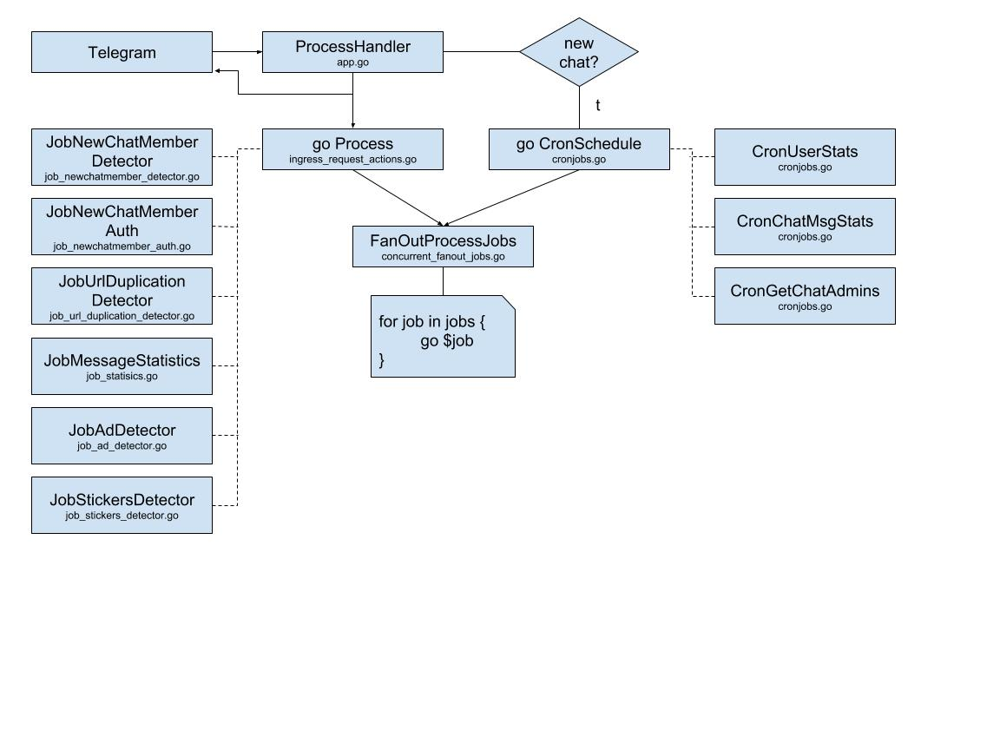
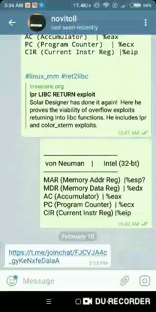

@novitoll_daemon_bot - Telegram bot
=====

.. contents::

Requirements
-------
	$ go version
    go1.12 linux/amd64

Features
-------

Bot features can be enabled/disabled via `config/features.json` and its ad-hoc struct `config/features.go`.

* duplicate hyperlinks detection within the certain amount of time
	* kindly reply with a notification
* newcomer questionnaire in bot's IM to prevent newcomers' shadow mode and post-action
	* greet a newcomer and kindly ask for the feedback upon the group joining in order to authenticate, otherwise user will be kicked for the certain time.
	* restricts newcomers to post links right after group join until first 15 mins
* sentiment detection
	* auto-delete the message with the sticker / if the whole message is emoji
	* kindly reply with a notification and auto-delete the reply
* flood detection
	* detects the limit of 3 messages within 10 seconds per user
	* detects the long-long text copy-paste
	* detects if in chat group, last 20 messages are posted between 3 users, regardless proportion (TBD)
* weekly chat statistics
	* weekly report generation of newcomers
	* weekly report generation of active users messages' stats
* ad detection
	* Other Telegram groups ads. Delete message if user is not in admin list.
* nude, pornography detection in image (TBD)
* batch scanning of users' avatars, and posting images' for steganography analysis (+ VirusTotal?) (TBD)
* job post validation (TBD)

Make commands
-------
* ``make configure`` -- configure `dep` GoLang package and install deps.
* ``make build`` -- compile Go src to the "$PWD/bot" binary.
* ``make run`` -- compile and run a standalone Go binary.
* ``make docker-compose-local`` -- For local development. Runs docker-compose that brings up 1 redis & 1 vahter-bot containers & 1 telegram-mock image.
* ``make docker-compose`` -- For the prod. Runs docker-compose that brings up 1 redis & 1 vahter-bot containers. `TELEGRAM_TOKEN` should be set as ENV var manually or in `.env` file. Containers run in deattached mode.
* ``make docker-compose-green`` -- For the green deployment running along with `make docker-compose` but on different TCP 8081 host port. Runs docker-compose that brings up 1 redis-dev & 1 vahter-bot-dev containers. `TELEGRAM_TOKEN` should be set as ENV var manually or in `.env` file.
* ``make docker-compose-stop`` -- Stops the containers run via `make docker-compose`.
* ``make test`` -- run unit tests.
* ``make debug`` -- compile and run `delve` debugger.
* ``make goimports`` -- format Go files with ``goimports`` utility in ``pwd``.

Deployment remarks
-------
Please notice that you may want to clear the Telegram bot updates queue in order not to process pending messages. To do so, you have to change the Telegram bot's webhook to some end-point, returning HTTP 200/202 responses for all pending messages. In our case, there is the HTTP GET ``/flushQueue`` end-point that returns 202.

Follow these steps on the running Telegram bot client instance.

1. Execute Bash script ``deployments/webhook.sh <TELEGRAM_BOT_TOKEN> setWebhook?url=https://<hostname>/flushQueue`` -- will set webhook to ``/flushQueue``

2. Make sure that Telegram sends all pending messages to this end-point and `pending_update_count` is 0, by checking::

	$ ./webhook.sh <TELEGRAM_BOT_TOKEN> getWebhookInfo
	{"ok":true,"result":{"url":"https://<hostname>/flushQueue","has_custom_certificate":false,"pending_update_count":0,"last_error_date":1540196953,"last_error_message":"Wrong response from the webhook: 404 Not Found","max_connections":40}}

3. Execute Bash script ``deployments/webhook.sh <TELEGRAM_BOT_TOKEN> setWebhook?url=https://<hostname>/process`` -- will set webhook back to usual ``/process``

License
-------
GNU GPL 2.0

Webhook flow
-------

Demo
-------

